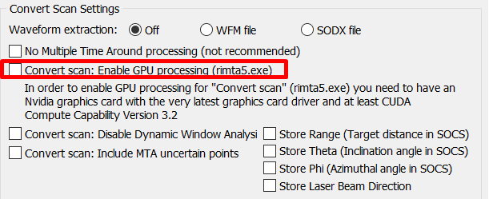
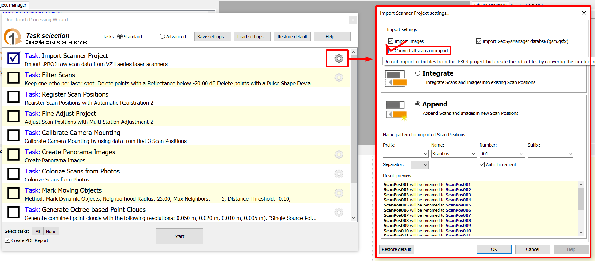
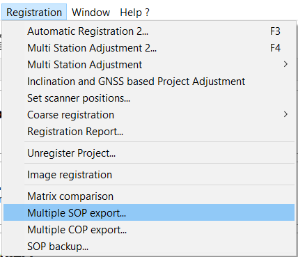
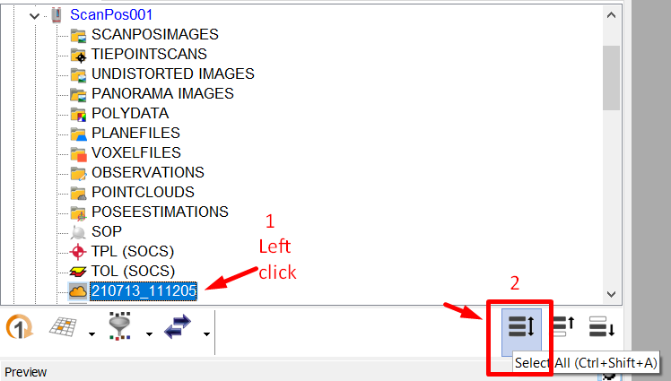
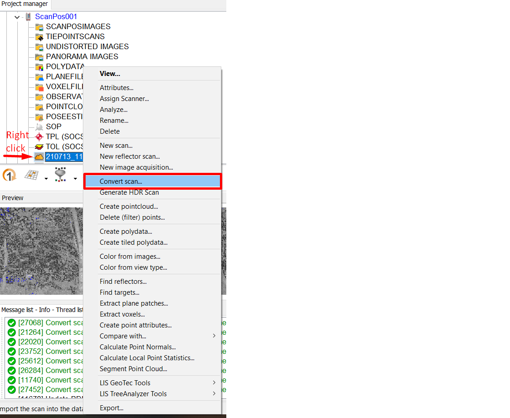
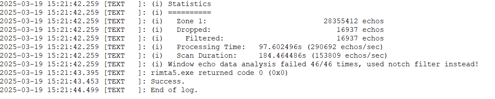

# Data preparation

### Useful information

#### Multiple Time Arround

RIEGL MTA (Multiple Time Around) processing is especially valuable in terrestrial laser scanning (TLS) of forest environments, where complex canopy structures and varying distances can cause overlapping laser pulse returns. The laser scanners may emit new pulses before previous ones have fully returned due to dense vegetation or long-range targets like tall trees or gaps in the canopy. MTA processing ensures that each return is accurately linked to its correct emitted pulse, preventing range ambiguities and ghost points. 

#### RXP
The .rxp file format is RIEGL’s proprietary raw data format used to store terrestrial LiDAR scan data. It contains detailed point cloud information, including 3D coordinates, intensity, multiple returns, and scanner metadata such as timestamps and instrument settings. 

#### RDBX
The .rdbx file in RIEGL’s LiDAR workflow is a project database used within RiSCAN PRO to organize scan data, metadata, and processing steps, including Multiple-Time-Around (MTA) corrections. When working with long-range terrestrial LiDAR data where multiple laser pulses may overlap in time, MTA processing is essential for accurately resolving pulse ambiguities. Once MTA is applied, the corrected point cloud data is stored and managed within the .rdbx structure.

### Processing in RiSCAN PRO

RiSCAN PRO is used to extract the three files (.rxp, .rdbx, .dat). The process involves converting the rxp to rdbx. 

1) The .rxp files are created when the scan is done. These are present in the .PROJ folder. 
Sometimes .rdbx files are also present. These files are NOT to be used. Ignore them. 

2) In RiSCAN PRO, switch off the GPU processing, ideally before importing the data. 

3) Create a new project and import the .PROJ file. 
While importing through the one touch wizard, check the convert all scans on import in settings. 
This will create new .rdbx files from the .rxp files.

4) Choose the filter settings (see note below) complete the co-registration of the data following the manuals ([VZ400](https://github.com/qforestlab/riscan-registration-VZ400), [VZ400i](https://github.com/qforestlab/riscan_registration))

5) Export individual SOP files after finalising coregistration.

6) Since you have filtered the scans to improve the co-registration (Step 2 of One-touch wizard), you will have to re-convert the .rxp files. 
You CANNOT use the filtered .rdbx files for vegetation profiles. Re-convert the scans by right-clicking the scan files. 
You can select multiple files and right-click to convert them all together.

7) Use the [data preparation script](./scripts/02-data_preparation.py) to organise all the files.

### Why are we doing this?

Gap-fraction methods use the information regarding the origin of a pulse and all of its returns. 
By linking the two sources of information we can basically get an idea of how the pulse of light traveled through the canopy and, importantly, where it was intercepted by vegetation, as recorded by the pulse returns. 
Therefore, it is essential to have accurate return information. The advancement in scanning systems allows us to scan at high frequencies (upto 1200 kHz in VZ400i). 
Scanning at high speeds necessitates processing the raw lidar signal to correctly identify the pulse returns, which is done by the MTA processing.
RiSCAN PRO uses the GPU for MTA processing, when available, to convert the .rxp to .rdbx. We observed that the use of GPU can result in inconsistent and incorrect handling of the returns. 
Therefore, we only use CPU to make sure the resulting .rdbx files are the same, thereby ensuring reproducibility. 

To check the that you are getting reproducible .rdbx files, you can access the convert logs (found here: "yourproject.RiSCAN\\project.rdb\\SCANS\\ScanPos001\\SINGLESCANS\\yourscan_timestamp\\").
Scroll down to the statistics section and observe the values in each zone. The number of zones increases with higher scan frequencies. The 'echoes' in each zone need to remain constant after conversion for reproducible results.

