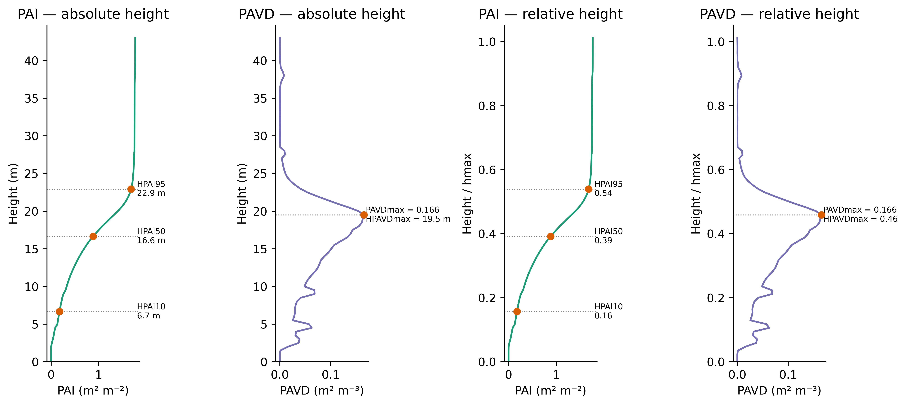
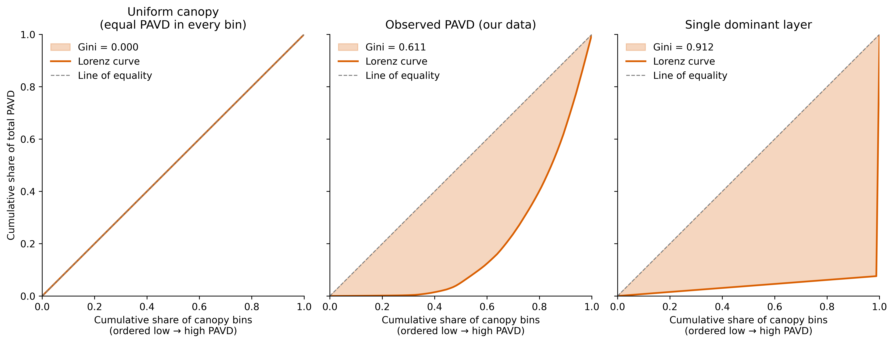
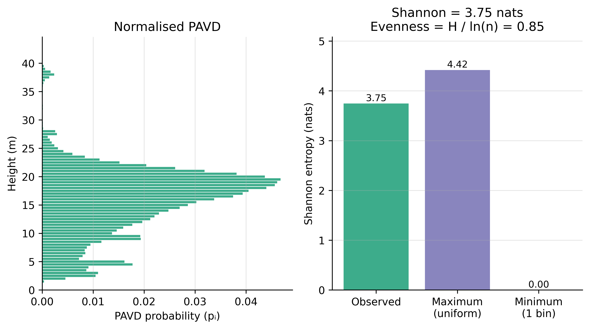

# Canopy Structure Metrics — A Visual Explainer

This document walks through the metrics computed from a pylidar vertical canopy profile. The example used throughout is a single stitched scan (`r1_001`, which is the upright scan + `r1_002`, which is the tilt scan) processed at 0.5 m vertical resolution. The file pairs the raw profile — gap fractions, cumulative PAI, and PAVD by height — with a small set of summary metrics derived from it. The goal here is to explain what those metrics mean, both numerically and ecologically.

---

## 1. The vertical profile: PAI and PAVD

The two foundational quantities in the profile are cumulative plant area index (PAI) and plant area volume density (PAVD).

**PAI** is the cumulative one-sided plant area per unit ground area, integrated from the ground upward. It is bounded between 0 (at ground level) and the total canopy PAI (at the canopy top).

**PAVD** is the per-bin density: how much plant area sits in each 0.5 m height slice, expressed per unit canopy volume (m² m⁻³). Where PAI is cumulative and monotonically increasing, PAVD is incremental — it rises and falls with the actual distribution of foliage through the canopy.

The figure shows both quantities against absolute height (left two panels) and against relative height (right two panels). The relative-height versions divide height by `hmax`, allowing canopies of different absolute heights to be compared on a common axis.

Three reference heights are marked on the PAI panels: **HPAI10**, **HPAI50**, and **HPAI95** — the heights at which cumulative PAI reaches 10%, 50%, and 95% of total. For this canopy:

- HPAI10 = 6.7 m (0.16 × hmax) — the bottom 10% of foliage sits in the understory layer.
- HPAI50 = 16.6 m (0.39 × hmax) — half the foliage is below this height.
- HPAI95 = 22.9 m (0.54 × hmax) — 95% of total PAI is reached by 22.9 m, meaning the upper 46% of canopy height contributes only 5% of total PAI.

The PAVD panels mark the densest layer with an orange dot: **PAVDmax = 0.166 m² m⁻³** at **HPAVDmax = 19.5 m** (0.46 × hmax). This is the main crown layer. PAVD tapers smoothly above and below, with a thin understory contribution below ~5 m and a sharp decline above ~22 m. Most of the canopy height above ~25 m is essentially empty — the profile extends to over 40 m, but those bins contain only sparse, isolated returns.

---

## 2. Vertical inequality: the Lorenz curve and Gini

The HPAI metrics describe where foliage sits. The Lorenz curve and Gini coefficient describe how unequally it is distributed across height bins.

The Lorenz curve is constructed by sorting all canopy bins from lowest to highest PAVD and plotting their cumulative share of total PAVD against the cumulative share of bins. If every bin held the same PAVD, the curve would fall exactly on the diagonal — the dashed "line of equality." The further the curve sags below the diagonal, the more concentrated the distribution.

The Gini coefficient is the area between the equality line and the Lorenz curve, multiplied by 2. It ranges from 0 (perfectly uniform) to 1 (all PAVD in a single bin).

The three panels show how the Lorenz curve changes across reference cases:

- **Left — uniform canopy.** Every bin contributes equally. The Lorenz curve sits exactly on the diagonal. Gini = 0.
- **Middle — observed PAVD.** The curve sags substantially below the diagonal. Gini = 0.611.
- **Right — single dominant layer.** Nearly all PAVD is in one bin. The curve hugs the bottom-right corner. Gini approaches 1.

The observed Gini of 0.61 places this canopy closer to the single-layer extreme than to uniform — foliage is strongly concentrated rather than spread evenly. In plain terms: the bottom half of canopy bins (sorted by PAVD) contributes only a small share of the total PAVD, while a relatively narrow band of high-density bins around the main crown holds the bulk of it.

---

## 3. Vertical spread: Shannon entropy

Shannon entropy approaches the same question — "how is PAVD distributed across height?" — from a different angle. Rather than measuring inequality, it measures **uncertainty**.

Think of it as a guessing game. Suppose I pick a random unit of plant area in the canopy, and you have to guess which 0.5 m height bin it came from. If foliage were spread perfectly evenly across all 57 occupied bins, you'd have no clue — any bin is equally likely, and you'd need many yes/no questions to narrow it down. If all the foliage were concentrated in a single bin, you'd guess correctly every time. Shannon entropy quantifies how many questions, on average, you'd need to identify the bin.

The metric is computed by normalising PAVD to a probability distribution (so the values sum to 1) and applying the standard Shannon formula H = −Σ pᵢ ln(pᵢ), in nats.

The left panel shows the normalised PAVD distribution as a horizontal bar chart against height. The shape mirrors the PAVD profile from Section 1: a clear peak around 19–20 m, a long tail of smaller contributions from ~5 to ~15 m, and a few isolated thin contributions above 25 m.

The right panel places the observed Shannon value against its theoretical bounds:

- **Maximum** (uniform PAVD across all bins): H = ln(n) = 4.42 nats, with n ≈ 83 occupied bins.
- **Minimum**  (all PAVD in one bin): H = 0.
- **Observed**: H = 3.75 nats.

Dividing the observed value by the maximum gives evenness = 3.75 / 4.42 = 0.85. This normalises away the dependence on the number of bins, allowing comparison across canopies of different heights or resolutions.

An evenness of 0.85 indicates that even though PAVD has a clear peak, foliage is present across most of the height range. The peak is a tall hill rather than a spike — the surrounding bins are not empty.

---

## 4. Reading Gini and Shannon together

Gini and Shannon both describe the spread of PAVD across height, but they emphasise different aspects of the distribution.

**Gini** is sensitive to *how unequal* the high-density bins are relative to the rest. It penalises a few dominant bins more heavily than many small ones.

**Shannon** is sensitive to *how many bins* are actively contributing. It rewards distributions where most bins hold *some* probability, even if one or two dominate in magnitude.

This canopy has a sharp peak (PAVDmax = 0.166 at 19.5 m) and a long tail of low-magnitude PAVD across most bins from ~2 m to ~28 m. That combination yields:

- A high Gini (0.61) — the crown layer holds a strongly disproportionate share.
- A high evenness (0.85) — but foliage is present in most height bins, even at low density.

Reported together, they describe the canopy as **dominated by a single crown layer, with a long, sparse tail of foliage distributed across most of the vertical profile**. Gini alone would miss that nearly every height bin contributes something, and Shannon alone would miss how concentrated the bulk of the PAVD actually is around the main crown.

---

## 5. Canopy geometry: hmax

The canopy top, `hmax`, is detected from the PAVD profile. A noise threshold (`1e-4` m² m⁻³) is applied to `hingePAVD`, and the highest bin above this threshold is declared the canopy top. For this profile, `hmax` = 28.5 m. The data file extends to 99.5 m because that is the analysis grid maximum, but everything above 28.5 m contains no detectable foliage and is trimmed from the profile before metrics are computed.

`hmax` matters because it is the denominator for the relative-height versions of HPAI10/50/95. A poor `hmax` estimate — for example, one inflated by a single noise spike high above the real canopy — would compress all the relative-height metrics toward smaller values and make the canopy appear bottom-weighted when it is not. The PAVD threshold guards against that.

---

## Summary

For this scan:

- **Total PAI**: 1.8 m² m⁻² (modest, consistent with open or leaf-off canopy).
- **Canopy top (hmax)**: 28.5 m.
- **Peak foliage layer**: PAVDmax = 0.166 m² m⁻³ at HPAVDmax = 19.5 m (0.46 × hmax).
- **Foliage centre of mass**: half the PAI accumulates by 16.6 m (HPAI50 = 0.39 × hmax), 95% by 22.9 m (HPAI95 = 0.54 × hmax). 
- **Vertical structure**: strong inequality (Gini = 0.61) combined with broad spread (Shannon = 0.85 of maximum) — a sharply dominant crown layer sitting above and below a long tail of lower-magnitude foliage.

The profile describes a canopy with foliage strongly concentrated in a narrow band around 20 m, but with continuous, low-magnitude PAVD extending across most of the lower and mid canopy.
